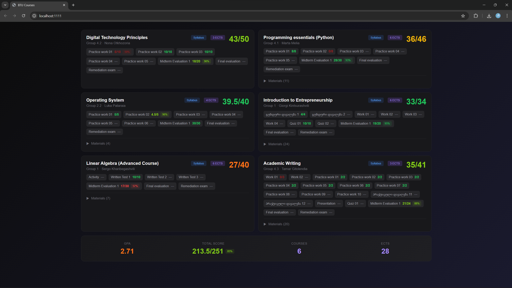

# BTU Classroom Dashboard
Personal dashboard for BTU Classroom. Shows courses, grades, materials.

## Manual Setup
1. open terminal in your chosen folder and copy-paste these commands
``` bash
git clone https://github.com/GeorgeAzma/btu-classroom-dashboard
cd btu-classroom-dashboard
python3 -m venv .venv # make sure python is installed first
pip install -r requirements.txt
python3 main.py
```
2. Sign In and enjoy

## Easy Setup
1. open command prompt and paste
``` bash
curl -sSL -o run.bat "https://raw.githubusercontent.com/GeorgeAzma/btu-classroom-dashboard/main/run.bat" && cd btu-classroom-dashboard && run.bat
```

### Notes
- Grades are updated every rerun
- Stop the script by pressing `Ctrl + C` inside terminal `TODO: fix`
- If you have a problem open Issue on GitHub, or comment on the post
- It is safe to run and passwords are not stored